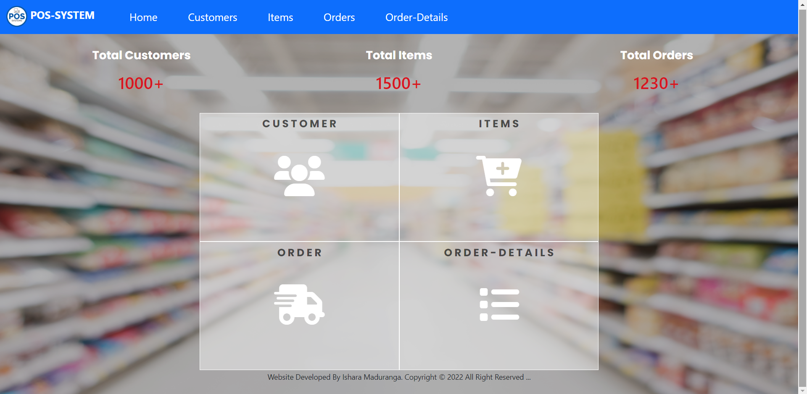
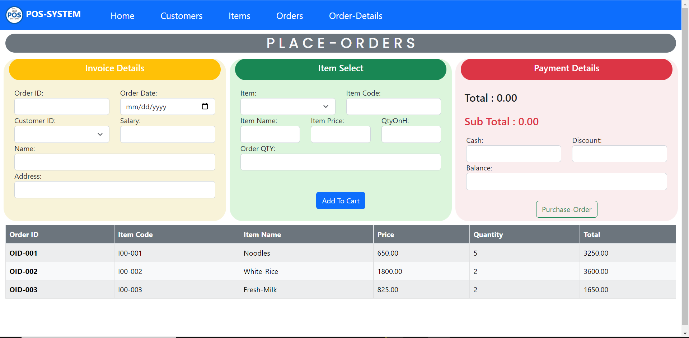
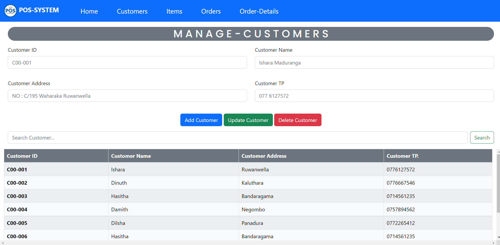
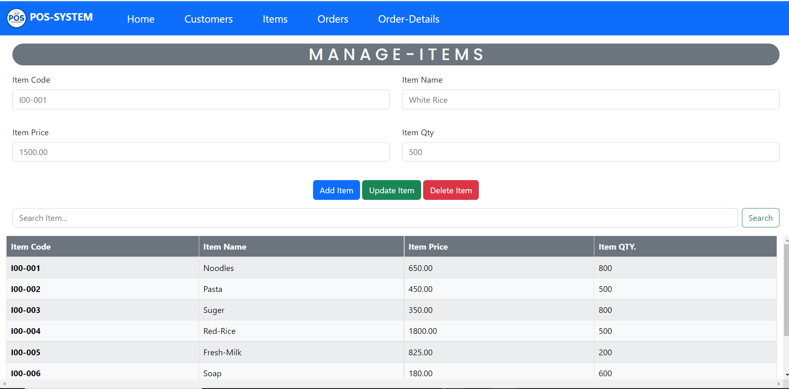

# My-Portfoliyo - Personal Web Site

## Description
#### This website designs for showing some information about my career.I categorize them into few sections...
* Home page
* Who am I
* What I Top Skills
* What are the technologies & Tools I use
* What kind of services I provide
* Projects & assignments I have done
* My Educational Background
* My contact details

#### Also,This website Optimized to Provide for All Mobile & Desktop Devices Can View 

## :link: Reference Links

🌱 Moke-Up-URL ---> [Click Me!](https://www.figma.com/proto/4mJXjz2mPQsSg21Im2JLeV/My_PortFilo_Mock-up?page-id=0%3A1&node-id=14%3A3&scaling=min-zoom&starting-point-node-id=14%3A3) 
🌱 Site-Map-URL----> [Click Me!](https://www.gloomaps.com/2KQ3vDp779) 
🌱 Wire-Frame-URL----> [Click Me!](https://wireframe.cc/pQAVpH) 
🌱 GitHub-Pages-URL----> [Click Me!](https://isharamaduranga.github.io/My-Portfolio/) 
🌱 InfinitiFree-WebHost-URL----> [Click Me!](http://isharamaduranga.epizy.com)

## Basic Background of PortFolio

## Technology /framework used
* HTML
* CSS
* Java Script

## License
**Copyright @ 2022 My PortFoliyo All Right Reserved By Ishara Maduranga**

 
 

# Web Pos System(Bootstrap) - Super-Market
#### Also,This website Optimized to Provide for All Mobile & Desktop Devices Can View

## :link: Reference Links

🌱 Moke-Up-URL ---> [Click Me!](https://www.figma.com/file/kJ5dbaCDIMbBH6S3eyZJwM/POS_System(Bootstrap)?node-id=0%3A1) 
🌱 Site-Map-URL----> [Click Me!](https://www.gloomaps.com/3XQDYVDqdC) 
🌱 Wire-Frame-URL----> [Click Me!](https://wireframe.cc/9oCnTI) 

## ✔ Description
#### This website designs for showing some proceed of web pos system.I categorize them into few Functionlities ...
### Manage Customer
* Register Customer
* Unregister Customer
* Find Customer
* Update Customer
* Get All Customers

### Manage Store
* Add Items
* Remove Items
* Search Items
* Update Items
* Get All Items

### Place Order
* Save a Customer Order
* Search Customer Order;
* Update Customer Order
* Delete Customer Order;
* Get All Customers Order

## Basic Background of Pos_System

### 🌱 DashBoard Interface

### 🌱 Place Order Manage Interface

### 🌱 Customers Manage Interface

### 🌱 Items Manage Interface

### 🌱 Order-Details Interface

## Technology /framework used
* HTML
* CSS
* Java Script
* Bootstrap-V5.2

## License
**Copyright @ 2022 Web_Pos_System All Right Reserved By Ishara Maduranga**