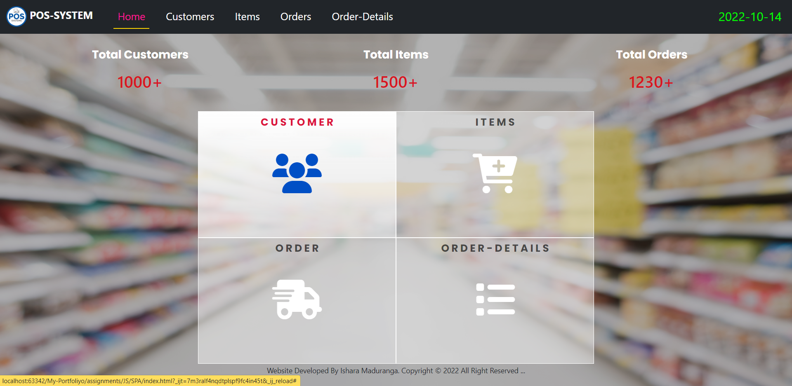
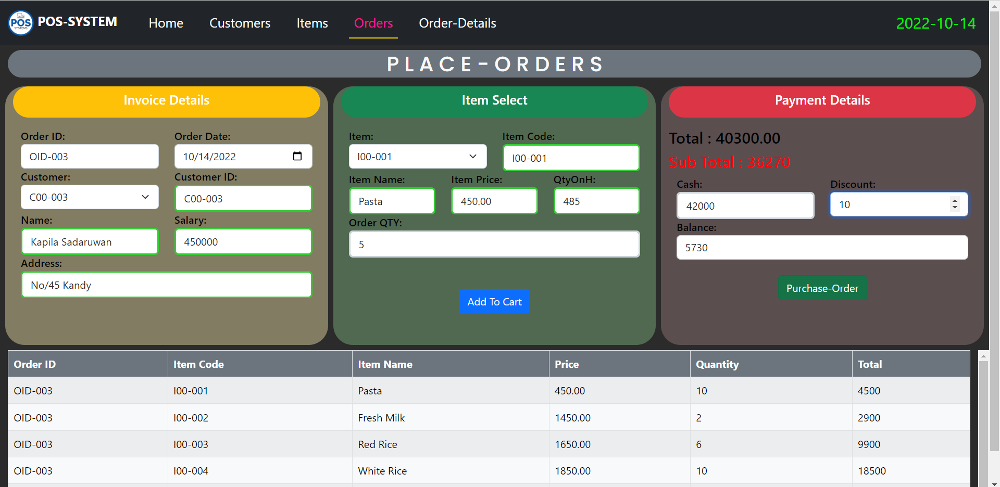
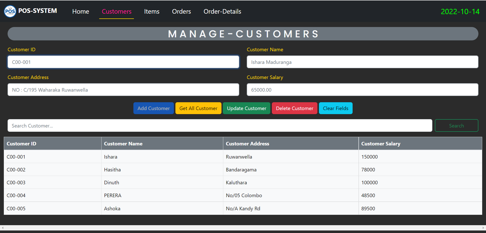
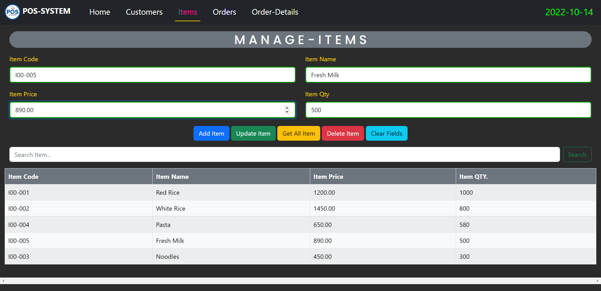
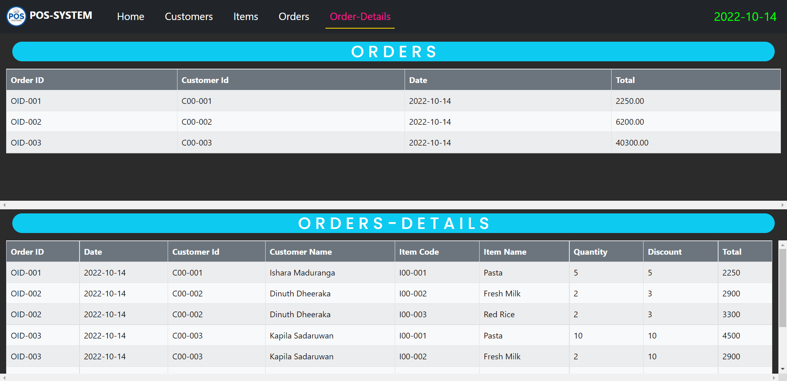

# Web Pos System(S P A) - Super-Market
#### Also,This website Optimized to Provide for All Mobile & Desktop Devices Can View

## :link: Reference Links

🌱 Moke-Up-URL ---> [Click Me!](https://www.figma.com/file/kJ5dbaCDIMbBH6S3eyZJwM/POS_System(Bootstrap)?node-id=0%3A1) 
🌱 Site-Map-URL----> [Click Me!](https://www.gloomaps.com/3XQDYVDqdC) 
🌱 Wire-Frame-URL----> [Click Me!](https://wireframe.cc/9oCnTI) 

## ✔ Description
#### This website designs for showing some proceed of web pos system.I categorize them into few Functionlities ...
### Manage Customer
* Register Customer
* Unregister Customer
* Find Customer
* Update Customer
* Get All Customers

### Manage Store
* Add Items
* Remove Items
* Search Items
* Update Items
* Get All Items

### Place Order
* Save a Customer Order
* Search Customer Order;
* Update Customer Order
* Delete Customer Order;
* Get All Customers Order

## Basic Background of Pos_System

### 🌱 DashBoard Interface

### 🌱 Place Order Manage Interface

### 🌱 Customers Manage Interface

### 🌱 Items Manage Interface

### 🌱 Order-Details Interface

## Technology /framework used
* HTML
* CSS
* Java Script
* Bootstrap-V5.2

## License
**Copyright @ 2022 Web_Pos_System All Right Reserved By Ishara Maduranga**

